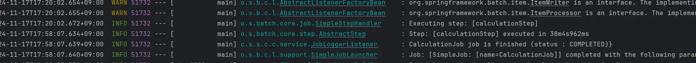
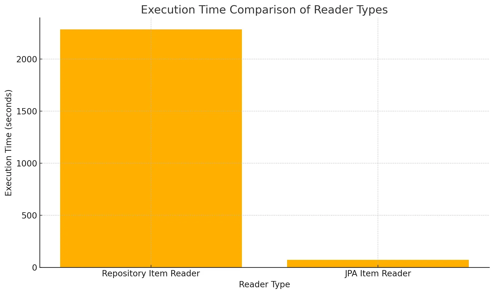
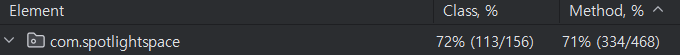
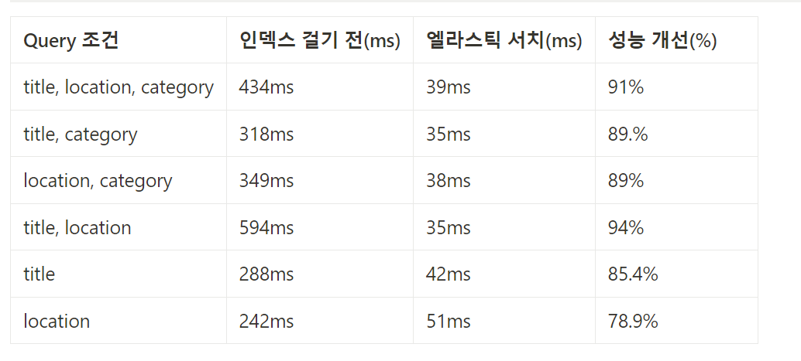
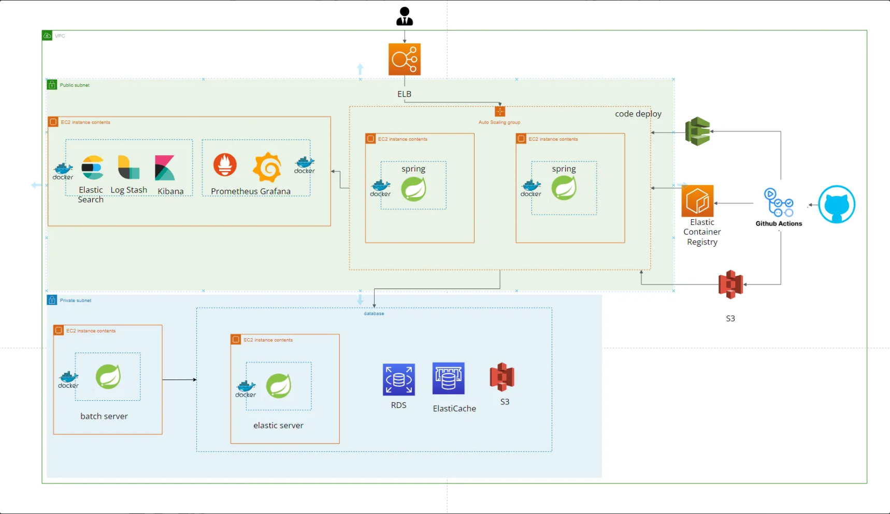
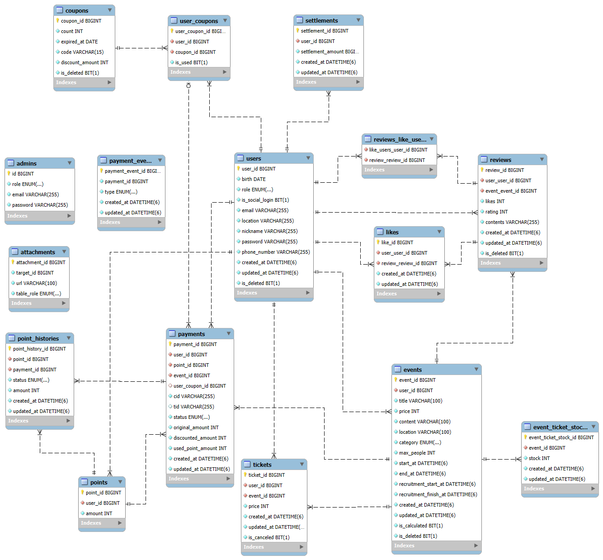

# 프로젝트명
소극장 (Spotlight Space)

---

## 목차
- 구성원
- 프로젝트 소개
- 프로젝트 핵심 목표
- 프로젝트 주요 기능
- key summary
- 트러블 슈팅
- 인프라 및 아키텍처
- ERD
- 개발환경
- 기능 및 설명
- 사용 기술

---

## 구성원

| 이름   | 역할         | 주요 기여 내용              | GitHub 링크 |
|--------|--------------|---------------------------|-------------|
| 강태영 | Sub Leader   | ElasticSearch, SSE, 인덱싱 | [프로필](https://github.com/kty0602) |
| 김동규 | Member       | 결제 및 동시성 문제 해결    | [프로필](https://github.com/bronbe) |
| 박한진 | Member       | 리뷰 및 좋아요 기능 구현    | [프로필](https://github.com/kanzinPark) |
| 조준호 | Leader       | CI/CD, 배치, 모니터링      | [프로필](https://github.com/juno0432) |
| 최원   | Member       | 쿠폰 발급, 관리자 기능      | [프로필](https://github.com/Choi1999) |

---

# 🎨 프로젝트 소개
잘 알려지지 않은 아티스트를 위한 **작은 공연/전시회 공간** 제공 서비스입니다.

-  **목표**:  
  아티스트들이 팬들과 소통하고, 이벤트를 통해 수익을 창출하도록 지원합니다.
-  **해결책**:  
  간단한 예약 시스템, 실시간 알림, 성능 최적화된 검색 기능을 제공합니다.

---

## 🌟 프로젝트 배경

###  문제점
- 대형 공연과 달리 **신예 아티스트**들은 홍보 및 지원이 부족하여 팬들과 교류하거나 무대를 설 수 있는 기회가 제한적입니다.

###  해결 방안
- **소극장 서비스**를 통해 작은 공연 및 전시회 공간을 제공하고 팬들과의 직접적인 소통을 지원합니다.
    - 📢 **팬과의 교류** 촉진
    - 💼 **수익 창출** 기회 제공

---

# 🚀 주요 기능

##  프로젝트 핵심 목표

### **테스트 코드 커버리지 유지**
- 테스트 코드 커버리지 **70%** 이상 유지

### 🔐 **결제 시스템 안전성**
- 동시성 제어로 신뢰도 높은 결제 시스템 구현
- 스프링 retry를 이용하여 재시도 가능한 예외의 경우에 재시도할 수 있도록 구현
- DB에 결제에 대한 이벤트를 저장하여 예상치 못한 에러에 대응

### ⚡ **성능 최적화**
- ElasticSearch 기반 이벤트 조회 속도 **88%** 개선

### 🛡️ **무중단 배포 및 보안 강화 서버 구축**

#### ⚙️ 안정적인 배포 및 운영 체계 구축
- **CI/CD** 적용:
    - GITHUB ACTIONS, DOCKER, AWS 활용
- **보안 강화**:
    - AWS WAF 기능으로 비정상적인 접근 및 해외 트래픽 차단
    - 참고 링크: [Transactional에 대해 알아보기](https://bronb.tistory.com/entry/Transactional-%EC%96%BC%EB%A7%88%EB%82%98-%EC%95%8C%EA%B3%A0-%EC%82%AC%EC%9A%A9%ED%95%98%EC%8B%9C%EB%82%98%EC%9A%94)

#### 📊 모니터링 시스템 구축
- **실시간 매트릭 모니터링**:
    - Prometheus, Grafana 활용

- **실시간 로깅 모니터링**:
    - ElasticSearch + Logstash + Kibana (ELK 스택) 사용
- 서버 상태 및 트래픽 확인을 통해 안정성 보장

---
# 프로젝트 주요 기능

### 상세 내용

| **항목**              | **결과**              |
|-----------------------|-----------------------|
| 결제 동시성 제어       | Pessimistic Lock 적용 |
| 게시글 중복 등록 방지  | REDIS 기반 분산락 적용 |
| ElasticSearch 조회 성능 | 최대 **94% 개선**     |
| 배치 처리 최적화       | **96% 성능 향상**     |
| 테스트 코드 커버리지   | **70% 이상 유지**     |

---

###  **동시성 제어**
- 결제 시스템의 동시성 제어를 위한 **Pessimistic Lock** 적용
    - [결제 시 재고에 대한 동시성 문제 해결](https://bronb.tistory.com/entry/%EA%B2%B0%EC%A0%9C-%EC%8B%9C-%EC%9E%AC%EA%B3%A0%EC%97%90-%EB%8C%80%ED%95%9C-%EB%8F%99%EC%8B%9C%EC%84%B1-%EB%AC%B8%EC%A0%9C-%ED%95%B4%EA%B2%B0)
- 게시글 중복 등록 방지를 위한 **REDIS 기반 분산 락** 적용
    - [동시성 제어(따닥 요청)](https://kty0602.tistory.com/79)

###  **결제 시스템**
- 카카오 API 연동을 통한 아티스트 후원 및 공연 예약 시스템 구현

###  **ElasticSearch를 통한 이벤트 조회**
- ElasticSearch를 활용하여 이벤트 조회 성능 최대 **94% 개선**
    - [엘라스틱 서치](https://kty0602.tistory.com/78)

###  **스프링 배치를 활용한 정산 로직**
- 스프링 배치를 활용한 정산 로직 최적화
    - [관련 링크](https://bronb.tistory.com/entry/Transactional-%EC%96%BC%EB%A7%88%EB%82%98-%EC%95%8C%EA%B3%A0-%EC%82%AC%EC%9A%A9%ED%95%98%EC%8B%9C%EB%82%98%EC%9A%94)
---

# 디테일

## 이런거까지 고민해봤다

primitive 타입과 wrapper 타입의 차이

Optional 사용 이유

final 키워드 사용 이유

controller, service 서로 다른 dto를 사용해야하나

@Transactional 어노테이션의 동작 원리

캐싱써서 성능이 빨라지는게 좋은가 정합성을 지키는게 좋은가

테스트 코드 작성시 어떤것을 테스트 해야하는가

## 기술적 의사결정

젠킨스 vs 깃헙액션

블루그린 vs 카나리 vs 롤링배포

모니터링

이메일을 비동기로 선택한 이유

스프링 배치

실시간 알림 SSE

---

# 🗝️ KEY SUMMARY

##  핵심 성능 개선: 스프링 배치를 활용한 정산 로직

---

###  한줄 요약
- **BATCH 재시작 로직** 도입으로 실패 시 재시작 구현
- **Reader 개선** 및 **Bulk Insert 활용**으로 쿼리 수와 DB 오버헤드를 감소, 처리 시간을 **96% 개선**

---

###  도입 배경
- 기존 스케줄러는 **오류 발생 시 재시작 로직**이 부족하여 유실 위험 존재
- N+1 문제와 개별 Insert로 인해 **DB 부하** 증가

---

###  개선 결과
- **JPA Item Reader** 도입으로 기존 Repository Item Reader 대비 성능을 **96% 개선**
- N+1 문제를 해결하고, 개별 Insert를 Bulk Insert로 전환하여 **DB 로직 최적화**
- 개선 전: **Repository Item Reader** 사용 시 과도한 쿼리 호출  
  
- 개선 후: **JPA Item Reader** 사용으로 쿼리 호출 최적화  
  

---

### 📈 개선 성능 차트
- 아래 차트는 개선 전후의 처리 시간을 비교한 결과를 시각화한 것입니다:  

---

## 🔧 핵심 트러블 슈팅
###  엘라스틱 서치를 활용한 성능 개선

---

###  한줄 요약
- **인덱스 제거** 및 **읽기 요청을 ElasticSearch로 분리**하여 조회 성능을 **88% 개선**

---

###  도입 배경
- 성능 최적화를 위해 **인덱싱을 적용**했으나, **읽기 성능은 개선**되었지만 **쓰기 성능이 악화**됨
- 이를 해결하기 위해 **인덱스 제거**와 **읽기 요청을 ElasticSearch로 분리**하여 성능을 최적화

---

###  개선 과정 및 결과
- **인덱싱 전후 성능 차이**  
  

- **개선 후 결과**  
  

- ElasticSearch를 통해 조회 성능을 **88% 개선**

---

###  주요 성과
- 읽기 요청과 쓰기 성능 간의 균형을 맞추며, 성능 최적화에 성공
- 인덱스 관리 전략 변경으로 시스템 부하 감소

--- 

# 🛠️ 트러블 슈팅

---

## 강태영

  
✅ 올바른 단위 테스트 작성

  

    - <a href="https://kty0602.tistory.com/80" target="_blank">Spy 어노테이션을 사용하여 단일 책임을 갖는 단위 테스트 작성</a>
  

  
📉 인덱스 도입으로 인한 쓰기 성능 저하 문제 해결

  

    - <a href="https://kty0602.tistory.com/81" target="_blank" style="text-decoration: none;">인덱스 도입 후 10배 증가한 쓰기 성능 문제를 ElasticSearch 도입으로 개선</a>
  
   

---

## 김동규

  
🌐 다중 서버 환경에서의 세션 관리

  - 다중 서버 환경에서 발생하는 세션 불일치 문제를 **Session Storage**로 해결  
  - [관련 링크](https://bronb.tistory.com/entry/%EB%8B%A4%EC%A4%91-%EC%84%9C%EB%B2%84-%ED%99%98%EA%B2%BD%EC%97%90%EC%84%9C%EC%9D%98-%EC%84%B8%EC%85%98-%EA%B4%80%EB%A6%AC)  

  
🔄 Transactional 얼마나 알고 사용하시나요?

  - 멀티 쓰레드 문제 해결 및 트랜잭션의 올바른 사용 방법 고찰  
  - [관련 링크](https://bronb.tistory.com/entry/Transactional-%EC%96%BC%EB%A7%88%EB%82%98-%EC%95%8C%EA%B3%A0-%EC%82%AC%EC%9A%A9%ED%95%98%EC%8B%9C%EB%82%98%EC%9A%94)  

---

## 조준호

  
🩺 ELB 헬스체크 문제

  - **무중단 배포**를 위해 ELB 헬스체크 문제를 해결  
  - [관련 링크](https://bronb.tistory.com/entry/Transactional-%EC%96%BC%EB%A7%88%EB%82%98-%EC%95%8C%EA%B3%A0-%EC%82%AC%EC%9A%A9%ED%95%98%EC%8B%9C%EB%82%98%EC%9A%94)  

  
🛡️ 악의적인 트래픽을 받지 않으려면

  - 모든 포트 허용으로 인한 **악의적인 트래픽 차단**을 위한 다양한 방법 도입  
  - [관련 링크](https://bronb.tistory.com/entry/Transactional-%EC%96%BC%EB%A7%88%EB%82%98-%EC%95%8C%EA%B3%A0-%EC%82%AC%EC%9A%A9%ED%95%98%EC%8B%9C%EB%82%98%EC%9A%94)  

  
📧 이메일 발송 비동기로 전환하기

  - 이메일 발송을 **비동기로 전환**하여 시스템 성능 최적화  
  - [관련 링크](https://bronb.tistory.com/entry/Transactional-%EC%96%BC%EB%A7%88%EB%82%98-%EC%95%8C%EA%B3%A0-%EC%82%AC%EC%9A%A9%ED%95%98%EC%8B%9C%EB%82%98%EC%9A%94)  

---

# 🏗️ 인프라 및 아키텍처

##  인프라 구조

---

###  주요 구성 요소

| **분류**        | **상세 내용**                                   |
|------------------|------------------------------------------------|
| **AWS**         | EC2, RDS, S3, CodeDeploy, ALB, VPC, ElastiCache |
| **CI/CD**       | GitHub Actions                                  |
| **배포**         | Docker                                          |
| **로그 수집**    | ElasticSearch, Logstash, Kibana                |
| **모니터링**     | Prometheus, Grafana                            |
| **로드 밸런서**  | AWS ALB                                        |
| **보안**         | AWS WAF                                        |

---

### 특이 사항
- **확장성**: AWS 기반으로 구성하여 서비스의 확장성과 안정성을 확보
- **CI/CD 자동화**: GitHub Actions와 Docker를 활용한 무중단 배포
- **모니터링**: Prometheus와 Grafana로 실시간 매트릭 관리
- **보안 강화**: AWS WAF를 활용해 비정상적인 접근 및 악의적 트래픽 차단

## ERD

## 개발 환경
| 분류          | 상세                          |
|---------------|-----------------------------|
| **IDE**       | IntelliJ                    |
| **Language**  | Java 17                     |
| **Framework** | Spring Boot 3.3.4           |
| **Repository**| MYSQL, REDIS, H2(Test)      |
| **Build Tool**| Gradle 8.8                  |
| **Infra**     | EC2, Docker, Github Actions |

## 상세 개발 환경

- **Spring Framework**
    - Spring WebMVC
    - Spring Validation
    - Spring Security
    - Spring Data JPA
    - Spring Data Redis
    - Spring Batch 5.1.2
    - Spring Boot Actuator

- **Authentication & Authorization**
    - JWT (jjwt 0.12.6)
    - Bcrypt

- **Database & Query**
    - MySQL, H2 (Test)
    - QueryDSL 5.0.0

- **Integration & APIs**
    - AWS S3 (Spring Cloud AWS 2.2.6.RELEASE)
    - Spring Boot Starter Mail
    - Slack API (Bolt 1.44.1)
    - ElasticSearch

- **Utilities**
    - Lombok
    - Spring Retry

- **Testing**
    - JUnit 5
    - Spring Security Test

- **Logging & Monitoring**
    - Logstash Logback Encoder 7.3
    - Prometheus (Micrometer Registry)

- **Frontend Rendering**
    - Thymeleaf

- **Reactive Programming**
    - Spring WebFlux

- **Documentation**
    - Swagger 2.6.0

---

# 기능 및 설명

회원 - 조준호

<ul>
<li>담당자: 조준호</li>
<li>회원 관리 로직을 수행하며, 로그인부터 OAuth2 기반 로그인, 비밀번호 찾기 시 이메일 발송까지 다양한 기능을 제공합니다.</li>
<li>기능:
  <ul>
    <li>회원 CRUD</li>
    <li>회원탈퇴</li>
    <li>회원조회</li>
    <li>비밀번호 변경</li>
    <li>쿠폰 조회</li>
    <li>정산 조회</li>
    <li>메일 발송 및 확인</li>
    <li>리프레시 토큰 재발급</li>
    <li>카카오 및 네이버 로그인 연동</li>
  </ul>
</li>
</ul>

결제 - 김동규

<ul>
<li>담당자: 김동규</li>
<li>카카오 페이 API를 연동하여 결제를 구축하였습니다.</li>
<li>기능:
  <ul>
    <li>결제하기</li>
    <li>결제취소</li>
    <li>결제내역</li>
  </ul>
</li>
<li>결제 시 발생할 수 있는 동시성 문제를 해결하였습니다.</li>
</ul>

정산 - 김동규, 조준호

<ul>
<li>담당자: 김동규, 조준호</li>
<li>스프링 배치와 스케쥴링을 사용하여 매달 1일 유저에게 포인트가 정산됩니다.</li>
<li>기능:
  <ul>
    <li>정산 처리</li>
  </ul>
</li>
</ul>

이벤트 - 강태영

<ul>
<li>담당자: 강태영</li>
<li>게시글과 관련된 기능입니다.</li>
<li>기능:
  <ul>
    <li>제목, 내용, 시작 시간, 종료 시간, 모집 기간, 제한 인원, 가격 등의 데이터를 요구합니다.</li>
    <li>이벤트 CRUD</li>
  </ul>
</li>
</ul>

첨부파일 - 강태영

<ul>
<li>담당자: 강태영</li>
<li>이벤트, 유저, 리뷰에서 사용할 수 있도록 테이블 별 구분 및 아이디 별 관리가 가능하도록 설계된 첨부파일 전용 관리 기능입니다.</li>
<li>기능:
  <ul>
    <li>첨부파일 CRUD</li>
  </ul>
</li>
</ul>

포인트 - 강태영

<ul>
<li>담당자: 강태영</li>
<li>티켓 구매 및 포인트 정산이 가능한 포인트 관리 기능입니다.</li>
<li>기능:
  <ul>
    <li>포인트 조회</li>
    <li>포인트 이력 조회</li>
    <li>포인트 충전</li>
  </ul>
</li>
</ul>

리뷰 - 박한진

<ul>
<li>담당자: 박한진</li>
<li>리뷰 서비스 로직을 수행하며, 이벤트 예매 시 공연 종료 시간이 지난 후 리뷰 CRUD 및 좋아요 기능을 제공합니다.</li>
<li>기능:
  <ul>
    <li>리뷰 작성</li>
    <li>리뷰 조회</li>
    <li>리뷰 수정</li>
    <li>리뷰 삭제</li>
    <li>좋아요</li>
  </ul>
</li>
</ul>

쿠폰 - 최원

<ul>
<li>담당자: 최원</li>
<li>쿠폰 발행과 관련된 작업을 수행하며, 동시성 처리를 통해 경합 문제를 해결했습니다.</li>
<li>기능:
  <ul>
    <li>쿠폰 생성</li>
    <li>쿠폰 조회</li>
    <li>쿠폰 발급</li>
    <li>쿠폰 삭제</li>
  </ul>
</li>
</ul>

관리자 - 최원

<ul>
<li>담당자: 최원</li>
<li>관리자 테이블을 따로 만들어 관리자가 유저를 확인할 수 있습니다.</li>
<li>기능:
  <ul>
    <li>리뷰 리스트 조회</li>
    <li>이벤트 리스트 조회</li>
    <li>유저 리스트 조회</li>
    <li>유저 권한 변경</li>
    <li>유저 삭제</li>
    <li>이벤트 삭제</li>
    <li>리뷰 삭제</li>
  </ul>
</li>
</ul>

---

# 사용 기술

REDIS

<ul>
<li><strong>도입 이유 및 근거</strong>:
  <ul>
    <li>빠른 데이터 처리속도</li>
    <li>TTL 지원: 만료 시간을 설정해 데이터 자동 삭제 가능</li>
    <li>다양한 데이터 구조 지원</li>
    <li>DB 부하 감소</li>
  </ul>
</li>
<li><strong>도입 목적</strong>:
  <ul>
    <li>이메일 인증: 인증번호 임시 저장소로 사용</li>
    <li>리프레시 토큰 관리: 빠른 조회와 유효기간 관리</li>
    <li>유저 로그아웃: 토큰 블랙리스트 관리</li>
    <li>Session Storage: 분산 환경에서 세션 불일치 해결</li>
  </ul>
</li>
<li><strong>기대 효과</strong>:
  <ul>
    <li>응답 속도 향상</li>
    <li>DB 부하 감소</li>
    <li>효율적인 토큰 관리</li>
  </ul>
</li>
</ul>

AWS

<ul>
<li><strong>도입 이유 및 근거</strong>:
  <ul>
    <li>다양한 서비스 지원</li>
    <li>확장성과 유연성</li>
    <li>다양한 보안 및 인증 지원</li>
    <li>비용 효율성</li>
  </ul>
</li>
<li><strong>도입 목적</strong>:
  <ul>
    <li>빠르고 유연한 웹 서비스 구축 및 배포</li>
  </ul>
</li>
<li><strong>기대 효과</strong>:
  <ul>
    <li>유연한 확장성</li>
    <li>운영 간소화</li>
    <li>비용 절감</li>
  </ul>
</li>
<li><strong>사용 기술</strong>:
  <ul>
    <li>EC2: 서버 운영</li>
    <li>RDS: 안정적인 데이터베이스 관리</li>
    <li>S3: 이미지 업로드 및 배포 관련 파일 관리</li>
    <li>ECR: Docker 이미지 저장 및 관리</li>
    <li>ElastiCache: 완전관리형 인메모리 DB</li>
    <li>로드밸런서: 대용량 트래픽 부하 분산</li>
    <li>CodeDeploy: 자동 배포 활성화</li>
  </ul>
</li>
</ul>

로그수집 (ELK)

<ul>
<li><strong>도입 이유 및 근거</strong>:
  <ul>
    <li>중앙화된 로그 관리</li>
    <li>실시간 로그 분석</li>
  </ul>
</li>
<li><strong>용도</strong>:
  <ul>
    <li>로그 수집 및 분석</li>
    <li>로그 시각화</li>
  </ul>
</li>
<li><strong>작동 원리</strong>:
  <ol>
    <li>Spring Boot → logstash가 로그 수집</li>
    <li>logstash → Elasticsearch로 데이터 저장 및 색인화</li>
    <li>Elasticsearch → Kibana로 데이터 시각화</li>
  </ol>
</li>
</ul>

모니터링 (프로메테우스 + 그라파나)

<ul>
<li><strong>도입 이유 및 근거</strong>:
  <ul>
    <li>서비스 상태 확인 및 사전 대응</li>
  </ul>
</li>
<li><strong>용도</strong>:
  <ul>
    <li>실시간 매트릭 수집 및 저장</li>
    <li>데이터 시각화</li>
  </ul>
</li>
<li><strong>기대 효과</strong>:
  <ul>
    <li>운영 효율성 향상</li>
    <li>실시간 문제 감지</li>
    <li>관리 편의성</li>
  </ul>
</li>
<li><strong>작동 원리</strong>:
  <ol>
    <li>Spring Boot Actuator → Prometheus가 메트릭 수집</li>
    <li>Prometheus → 데이터 저장 및 관리</li>
    <li>Prometheus → Grafana로 데이터 시각화</li>
  </ol>
</li>
</ul>

SPRING BATCH

<ul>
<li><strong>도입 이유 및 근거</strong>:
  <ul>
    <li>대량 데이터의 정기적 안정적 처리 필요</li>
  </ul>
</li>
<li><strong>도입 목적</strong>:
  <ul>
    <li>정산 처리 안정성 확보</li>
    <li>스케줄링과 결합해 배치 수행</li>
    <li>재시작과 스킵 기능을 통한 안정적 데이터 처리</li>
  </ul>
</li>
<li><strong>기대 효과</strong>:
  <ul>
    <li>실패 시 재시작 가능</li>
    <li>모듈화로 유지보수성 향상</li>
  </ul>
</li>
</ul>

GitHub Actions

<ul>
<li><strong>도입 이유 및 근거</strong>:
  <ul>
    <li>YAML 기반으로 간편하게 CI/CD 파이프라인 구축</li>
    <li>별도 서버 설치 없이 이용 가능</li>
    <li>통합된 CI/CD 파이프라인 제공</li>
  </ul>
</li>
<li><strong>도입 목적</strong>:
  <ul>
    <li>자동화된 배포 프로세스 구축</li>
    <li>팀 협업 활성화</li>
  </ul>
</li>
<li><strong>기대 효과</strong>:
  <ul>
    <li>개발 효율성 향상</li>
    <li>운영 간소화</li>
  </ul>
</li>
</ul>

ElasticSearch

<ul>
<li><strong>도입 이유 및 근거</strong>:
  <ul>
    <li>빠른 검색 성능</li>
    <li>대용량 데이터 처리</li>
  </ul>
</li>
<li><strong>도입 목적</strong>:
  <ul>
    <li>데이터 검색 속도 개선</li>
    <li>실시간 분석</li>
  </ul>
</li>
<li><strong>기대 효과</strong>:
  <ul>
    <li>검색 성능 향상</li>
    <li>운영 효율성 증가</li>
  </ul>
</li>
</ul>

DOCKER

<ul>
<li><strong>도입 이유 및 근거</strong>:
  <ul>
    <li>효율적인 리소스 활용</li>
    <li>자동화된 배포 가능</li>
  </ul>
</li>
<li><strong>도입 목적</strong>:
  <ul>
    <li>EC2 서버 배포</li>
    <li>모니터링 시스템 구축</li>
  </ul>
</li>
<li><strong>기대 효과</strong>:
  <ul>
    <li>배포 효율성 증가</li>
    <li>운영 관리 간소화</li>
    <li>확장성 확보</li>
  </ul>
</li>
</ul>

SSE

<ul>
<li><strong>도입 이유 및 근거</strong>:
  <ul>
    <li>단방향 통신 필요성</li>
  </ul>
</li>
<li><strong>도입 목적</strong>:
  <ul>
    <li>효율적인 알람 전송</li>
  </ul>
</li>
<li><strong>기대 효과</strong>:
  <ul>
    <li>네트워크 및 서버 자원 절약</li>
    <li>실시간 알림 보장</li>
  </ul>
</li>
</ul>

카카오페이 API

<ul>
<li><strong>도입 이유 및 근거</strong>:
  <ul>
    <li>결제 기능 지원</li>
    <li>국내 사용자 친화성</li>
    <li>다양한 결제 옵션 제공</li>
  </ul>
</li>
<li><strong>도입 목적</strong>:
  <ul>
    <li>간편 결제 제공</li>
    <li>결제 안정성 및 신뢰성 확보</li>
  </ul>
</li>
<li><strong>기대 효과</strong>:
  <ul>
    <li>사용자 편의성 향상</li>
    <li>결제 프로세스 효율화</li>
  </ul>
</li>
</ul>

SMTP

<ul>
<li><strong>도입 이유 및 근거</strong>:
  <ul>
    <li>유저 인증 시 이메일 인증 필요</li>
  </ul>
</li>
<li><strong>도입 목적</strong>:
  <ul>
    <li>신뢰성 높은 이메일 전송</li>
  </ul>
</li>
<li><strong>기대 효과</strong>:
  <ul>
    <li>보안 향상</li>
    <li>자동화된 프로세스</li>
  </ul>
</li>
</ul>

